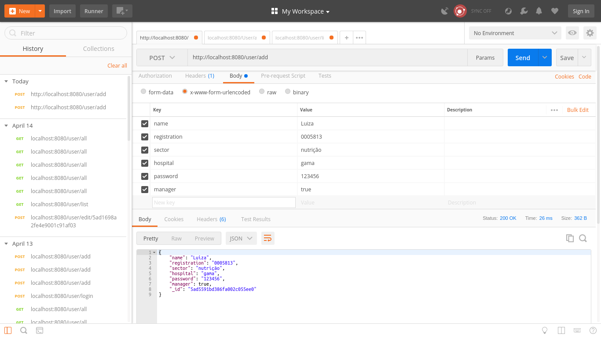
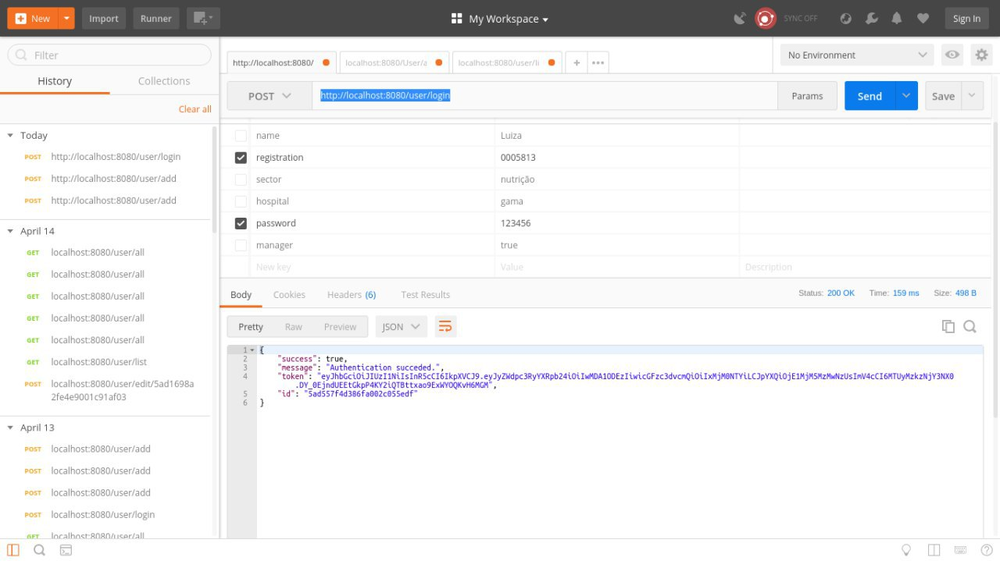
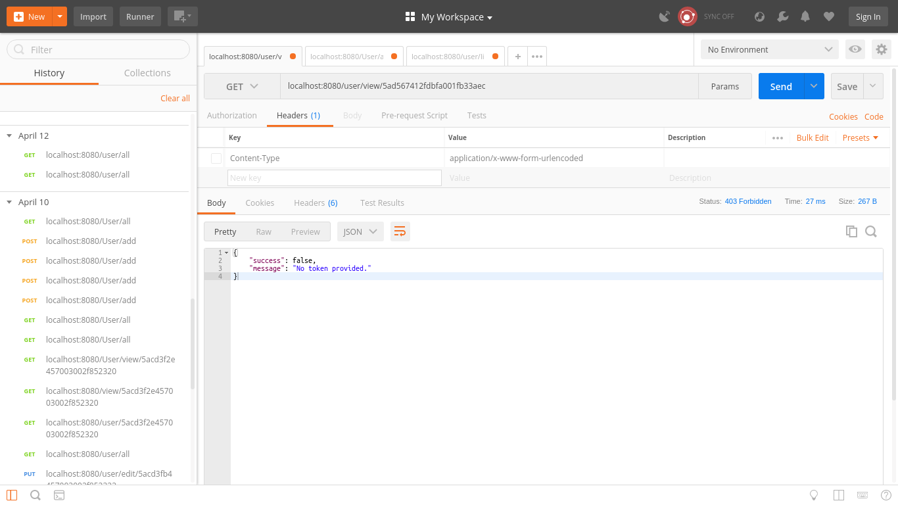
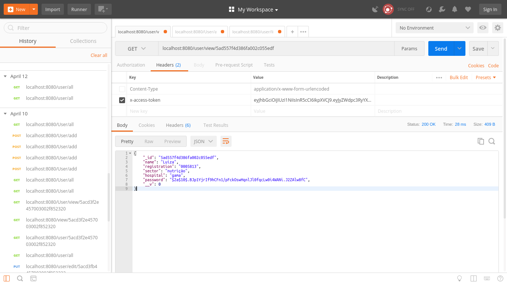
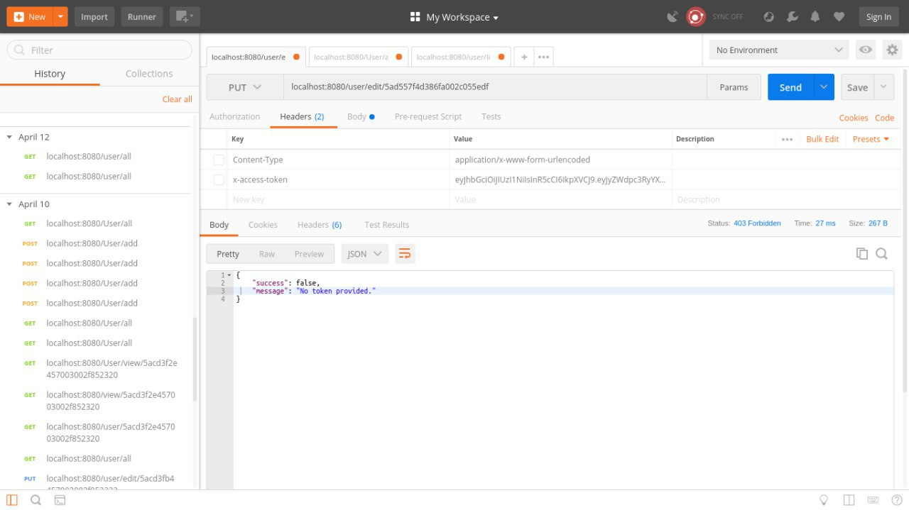
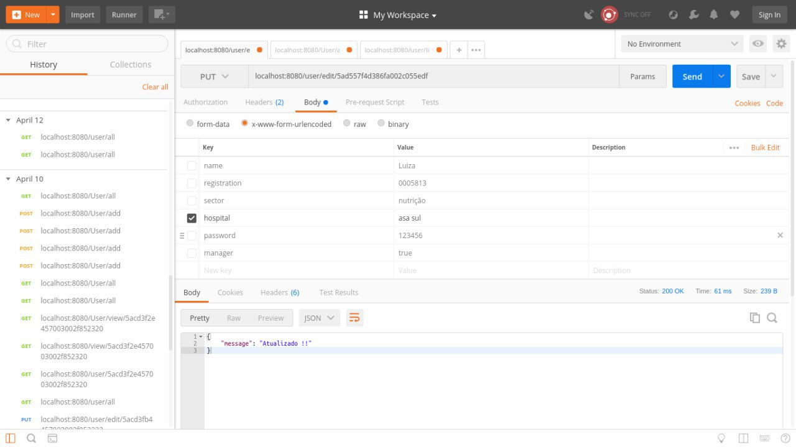

# Dulce-API

Dulce-API provê API's Restful para o desenvolvimento de Apps utilizando microsserviços.
Cada API descreve apenas uma funcionalidade de um sistema, isso torna a aplicação modular e favorece o baixo acoplamento.

## Instalação e uso

Para utilizar as API disponíveis e customizá-las para se adequar ao seu sistema, basta seguir os seguintes passos :

Clone o repositório utilizando o comando (o símbolo "$" não deve ser copiado. Apenas indica que tal comando
deve ser digitado em seu terminal) :

    $ git clone origin https://github.com/fga-gpp-mds/2018.1-Dulce_API

Entre no diretório em que há o arquivo Dockerfile. Se você estiver utilizando o terminal linux, basta digitar :

    $ cd 2018.1-Dulce_API;cd User

Observe que há um arquivo Dockerfile neste diretório. Agora basta digitar o seguinte comando :

    $ sudo docker-compose up --build

Observe a execução, e quando surgir no terminal a seguinte expreção: _Funcionou_ , acesse no seu navegador a porta 8080
do servidor local por meio do link [localhost:8080](http://localhost:8080)

* Ao abrir o link a seguinte mensagem será exibida: `{"success":false,"message":"No token provided."}`, significa que o acesso foi concluído. Porém, para ter acesso é necessário o token de usuário.

## Postman

Para testar os métodos HTTP de requisições, basta utilizar a aplicação [Postman](https://www.getpostman.com/),
que permite o envio e recebimento dados via requisições HTTP.
.

#### Requisições

*  Para adicionar um usuário através do Postman, devemos digitar a seguinte rota: `http://localhost:8080/user/add`

O método para adicionar usuario deve ser o ***POST*** e na subseção ***BODY*** deve conter os respectivos atributos do usuario, que são:
name, registration, sector, hospital, password.
Non
Ao clicar em ***SEND*** , será exibido um ***JSON*** com as informações do usuario , isso confirmará o cadastro do usuário.

 

 * Para logar um usuário através do Postman, devemos digitar a seguinte rota: `http://localhost:8080/user/login`

 O método para ***LOGIN***, deve ser o ***POST*** e na subseção ***BODY*** deve conter os atributos registration , password.

Ao clicar em ***SEND*** , será exibido um ***JSON*** com o status de sucesso ao logar , uma messagem indicando sucesso , o token, id do usuario , isso confirmará o sucesso ao logar o usuário.

* Para Visualizar um usuário através do Postman, devemos digitar a seguinte rota: `http://localhost:8080/user/view/id`, o id e gerado no momento da criação do usuário.

O método para ***VIEW***, deve ser o ***GET*** .

Ao clicar em ***SEND*** , será exibido um ***JSON*** , informando o sucesso ou a falha da visualização e uma mensagem.

No caso acima , houve falha pois para acessar a visualizaçao é necessário um token do usuário.

Para ter sucesso ao visualizar a informações do usuario logado , na subseção HEADERS deverá conter `x-access-token` tendo o valor do token válido  do usuário, com isso será possível obter sucesso na visualização.

* Para Editar um usuário através do Postman, devemos digitar a seguinte rota: `http://localhost:8080/user/edit/id`, o id e gerado no momento da criação do usuário.

O método para editar usuario deve ser o ***PUT*** e na subseção ***BODY*** deve conter os respectivos atributos do usuario que serão editados.

Ao clicar em ***SEND*** , será exibido um ***JSON*** com status e mensagem indicando sucesso ou falha na edição

No caso acima , houve falha pois para acessar a edição é necessário um token do usuário ao qual tera o perfil editado.

Para ter sucesso ao editar a informações do usuario logado , na subseção HEADERS deverá conter `x-access-token` tendo o valor do token válido  do usuário, com isso será possível obter sucesso na visualização.

